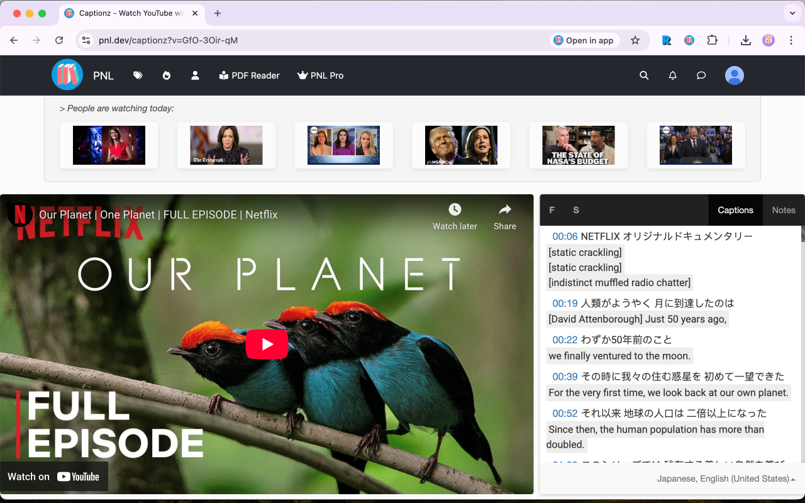
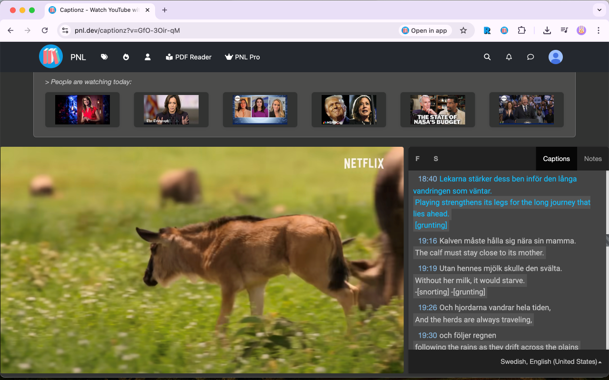

# Captionz Extension

**Captionz** is the companion extension for [Captionz](https://pnl.dev/captionz). It supercharges your language learning on YouTube by enabling dual subtitles, A-B repeating, and community notes.

## Features

- **Seamless Integration**: Automatically syncs YouTube captions with the Captionz web app.
- **Dual Subtitles**: Watch YouTube videos with two subtitles simultaneously.
- **Auto-Translate Support**: Easily enable auto-translated captions for any language.
- **Quick Access**: 
  - Adds a "Watch on Captionz" button directly to the YouTube video page.
  - Right-click any video link to open it in Captionz via the Context Menu.

## Install

### Store Links
- **Chrome**: [Chrome Web Store](https://chromewebstore.google.com/detail/captionz-youtube-dual-sub/epmnpaienfgfkbbjeccpdcfajcppiphj).
- **Firefox**: *Status: Pending Review.* Stay tuned. [Firefox Add-ons](https://addons.mozilla.org/en-US/firefox/addon/captionz)
- **Edge**: *Status: Pending Review.* Stay tuned. [Microsoft Edge Add-ons](https://microsoftedge.microsoft.com/addons/detail/ahlpbaaifbkaffdcebjbefamphbppjjb)

### Manual Installation
1. Download the source code.
2. Go to `chrome://extensions/` in your browser.
3. Enable **Developer mode** (top right).
4. Click **Load unpacked** and select the extension folder.

## Screenshots






## Build

To pack the extension into a `.zip` file for distribution:

```bash
# Default (Chrome)
./pack.sh

# Firefox
BROWSER=Firefox ./pack.sh

# Edge
BROWSER=Edge ./pack.sh
```

## Links

- **Main App**: [pnl.dev/captionz](https://pnl.dev/captionz)
- **Discord**: [Join our community](https://discord.gg/sazRac4kSa)

## Privacy Policy

[See here](privacy.md)